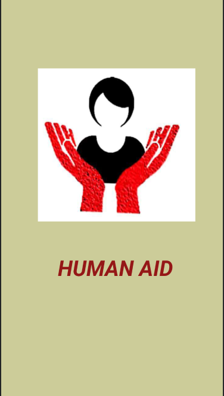

# Encipher_Cod-ngCheetas_WomenSafety

<h1 align ="center"> :information_desk_person: Human Aid :ok_woman: </h1>
<h3 align ="center"> There is no tool for development more effective than the empowerment of women.</h3>

# HumanAid : we care your safety
Personal safety and timely help is absolute necessity. We strongly believe that timely help in right
time may help many needy ones and can decrease this crime rate a bit.
Our App ##HumanAid will help people to tackle such emergency situations and will ensure women. We believe that our app will contribute in decreasing this rate of crimes and
ensure safety to women.
Our idea is to build an app that ensures safety to everyone especially women by
providing timely help in emergency situation. The idea is to build a user-friendly and robust
application that can help individuals by sending emergency alert messages along with current
location and also that can be triggered with minimal efforts. Along with these additional features
are listed below.
We have desgined the Login UI For New User As well as For Signup using ADOBE XD FOR THE USER INTERFACE VIEW.
Content:
## Splash Screen 

## Login Page 

## Registeration Page

## Home Page

## Add Relative

## Helpline Numbers

## Triggers

## Fake Siren

## Location Alert

 

## :iphone: Salient Features:

#### :telephone_receiver: Trigger Button -
Press the volume up/down button for 5 seconds, this will send a message along with the location and a call to the registered mobile numbers.

#### :telephone: Helpline Numbers - 
One-click access to helpline numbers like Women in distress, Domestic abuse, Police, student/child helpline, Ambulance.

 

 

# :calling: How to use:
#### Step-1 :
Register to your account using your mobile number.
#### Step-2 :
Add your family & friends mobile number.
#### Step-3 :
When in emergency, hold the volume up/down button for 5 seconds.
A message will be sent along with the live location and the family member with the first preference will receive a call.

 

## 📊 Technologies Used
- Java

 

## 💯 Tools
- Android Studio

 

## :star2: Members
- [Ayush Saxena]
- [Priyadarshani Patel]

## CODE FOR HUMANAID
## https://github.com/Ayush-111/HUMANAID_LATEST

